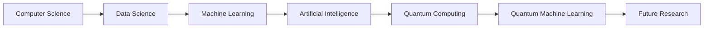

## 🌍 About Me


I am **Mohamed Bouchekouf**, a Computer Science graduate from Algeria 🇩🇿 passionate about exploring the intersection of:

- ⚛️ Quantum Computing
- 🤖 Artificial Intelligence
- 📊 Data Science
- 👁️ Computer Vision
- 🧬 Computational Biology

Currently serving as a **Quantum Computing Ambassador at PKTRON**, where I contribute to promoting quantum education and innovation.

My mission is to bridge the gap between **classical machine learning** and **quantum technologies** through research, experimentation, and open-source development.

<br clear="right"/>

---

## 🔭 What I'm Working On

```text
⚛️ Quantum Circuit Design
🤖 Quantum Machine Learning
📊 Advanced Data Science Projects
👁️ Computer Vision Applications
🧬 AI for Biological Data Analysis
🚀 Educational Quantum Simulators
```

---

## ⚡ Current Focus

| Field | Status |
|---------|---------|
| Quantum Computing | ████████████ 95% |
| Machine Learning | ████████████ 95% |
| Data Science | ████████████ 90% |
| Computer Vision | ██████████░░ 85% |
| Quantum Machine Learning | █████████░░░ 80% |

---

## 🧠 Research Interests

- Variational Quantum Algorithms
- Quantum Neural Networks
- Hybrid Quantum-Classical Models
- Explainable Artificial Intelligence
- Optimization Problems
- Scientific Machine Learning
- Quantum Data Encoding
- Biological Image Analysis

---

## 🏆 Experience

### ⚛️ Quantum Computing Ambassador — PKTRON

- Promoting quantum education worldwide
- Developing educational content
- Supporting quantum learning initiatives
- Community engagement and mentoring

### 🧬 Research Assistant Intern

**Biotechnology Research Center — Algeria**

- Applied KAN Networks for interpretable modeling
- Developed Computer Vision solutions using YOLO
- Worked on biological image analysis pipelines

### 📢 Social Media Specialist

- Content strategy
- Analytics
- Brand growth
- Digital storytelling

---

## 🌌 Quantum Philosophy

```python
while curiosity:

    learn()

    experiment()

    build()

    share()

    repeat()
```

---

## 📚 Learning Journey



---

## 📈 Weekly Development Breakdown

```text
Quantum Computing      █████████████░░░░   45%

Machine Learning       ██████████░░░░░░░   30%

Research               ███████░░░░░░░░░░   15%

Open Source            ████░░░░░░░░░░░░░   10%
```

---

## 🌐 Find Me Online

<div align="center">

<a href="mailto:Mohamed.bouchekouf@univ-constantine2.dz">

</a>

<a href="https://www.linkedin.com/in/mohamed-bouchekouf/">

</a>

</div>

---

## 💡 Fun Facts

- ⚛️ Quantum Computing Ambassador at PKTRON
- 🤖 Passionate about Quantum AI
- 📊 Love transforming data into insights
- 🧬 Interested in computational biology
- 🚀 Inspired by Richard Feynman
- 🌍 Always learning new technologies

---

## ✨ Motto

> "The future belongs to those who understand both bits and qubits."


