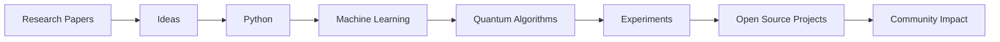

<div align="center">


</div>

---

# 👨‍💻 About Me


```python
class MohamedBouchekouf:

    location = "Algeria 🇩🇿"

    degree = "Bachelor of Computer Science"

    current_roles = [
        "Data Scientist",
        "Quantum Computing Ambassador @ PKTRON",
        "AI Researcher"
    ]

    interests = [
        "Quantum Computing",
        "Quantum Machine Learning",
        "Artificial Intelligence",
        "Data Science",
        "Computer Vision",
        "Computational Biology"
    ]

    motto = "Transforming data into intelligence."
```

- ⚛️ Quantum Computing Ambassador at PKTRON
- 🧬 Research Assistant in AI & Biotechnology
- 🤖 Passionate about AI and Quantum Technologies
- 📊 Building Data Science & Machine Learning Solutions
- 🚀 Exploring the future of Quantum Machine Learning

<br clear="right"/>

---

# ⚡ Tech Arsenal

<div align="center">


</div>

---

# 🧰 Technologies & Tools

| Category | Technologies |
|-----------|-------------|
| Programming | Python, SQL |
| Data Science | Pandas, NumPy, Matplotlib, Scikit-Learn |
| AI & Deep Learning | TensorFlow, PyTorch |
| Computer Vision | OpenCV, YOLO |
| Quantum Computing | Qiskit, Quantum Circuits |
| Development | Git, GitHub, VS Code |
| Platforms | Linux, Docker |
| Cloud | Azure |

---

# 🔭 Current Focus

```text
⚛️ Quantum Computing        ██████████████ 95%

🤖 Artificial Intelligence  ██████████████ 95%

📊 Data Science             █████████████░ 90%

👁️ Computer Vision          ███████████░░░ 85%

🚀 Quantum Machine Learning ██████████░░░░ 80%
```

---

# 🧠 Research Interests

```yaml
research_areas:

  - Quantum Machine Learning

  - Variational Quantum Algorithms

  - Hybrid Quantum-Classical Models

  - Explainable Artificial Intelligence

  - Computational Biology

  - Computer Vision

  - Scientific Machine Learning

  - Quantum Optimization
```

---

# ⚛️ Quantum Journey

```text
2023 ───── Computer Science Graduate

2025 ───── Biotechnology Research Center
           AI & Computer Vision Research

2025 ───── Azure Community

2026 ───── PKTRON Quantum Ambassador

2026 ───── Egypt Quantum Computing Community

Future ─── Quantum Machine Learning Research
```

---

# 📈 GitHub Analytics

<div align="center">


</div>

<br>

<div align="center">


</div>

---


# 📊 Contribution Graph

<div align="center">


</div>

---

# 📋 GitHub Summary

<div align="center">


</div>

<br>

<div align="center">


</div>

---

# 🚀 Featured Projects

### ⚛️ Quantum Circuit Simulator

Interactive platform for learning and visualizing quantum circuits.

### 🤖 AI Computer Vision Systems

YOLO-powered object detection and image analysis.

### 🧬 Computational Biology Research

KAN Networks and AI models for biological datasets.

### 📊 Data Science Portfolio

Machine Learning and Predictive Analytics projects.

### 🚀 Quantum AI Experiments

Exploring the intersection of AI and Quantum Computing.

---

# 🌌 My Workflow



---

# 💻 Weekly Development Breakdown

```text
Quantum Computing      █████████████░░░░ 45%

Machine Learning       ██████████░░░░░░░ 30%

Research               ███████░░░░░░░░░░ 15%

Open Source            ████░░░░░░░░░░░░░ 10%
```

---

# 🌍 Connect With Me

<div align="center">

<a href="mailto:Mohamed.bouchekouf@univ-constantine2.dz">

</a>

<a href="https://www.linkedin.com/in/mohamed-bouchekouf/">

</a>

</div>

---

# ⚡ Fun Facts

```yaml
favorite_language: Python

favorite_field: Quantum Computing

favorite_framework: Qiskit

favorite_quote:
  "Nature isn't classical..."
```

---

# 🐍 Contribution Snake

<div align="center">


</div>

---

# 🌌 Quantum Philosophy

<div align="center">

### ⚛️ "Nature isn't classical, and if you want to make a simulation of nature, you'd better make it quantum."

### — Richard Feynman

</div>


